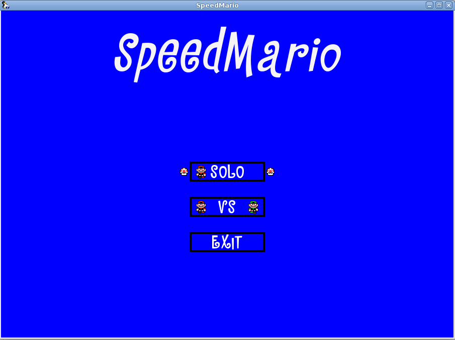

# Speedmario
### A Simple Platform game writed in c++/SFML
player 1 control: arrow keys up,down,left,right  
player 2 control: keys Z,S,Q,D  
### Compilation
You must install SFML(2.5) -dev lib.

```sh
$ git clone https://github.com/Crabman77/speedmario.git
$ cd speedmario
$ g++ main.cpp -o speedmario Engine.cpp Hud.cpp Button.cpp Perso.cpp Piece.cpp Cake.cpp Platform.cpp -lsfml-graphics -lsfml-window -lsfml-system -lsfml-audio -std=c++14
```
Launch
```sh
./speedmario
```

A version writed with GDevelop playable in navigator: https://crabman77.itch.io/speed-mario





 
